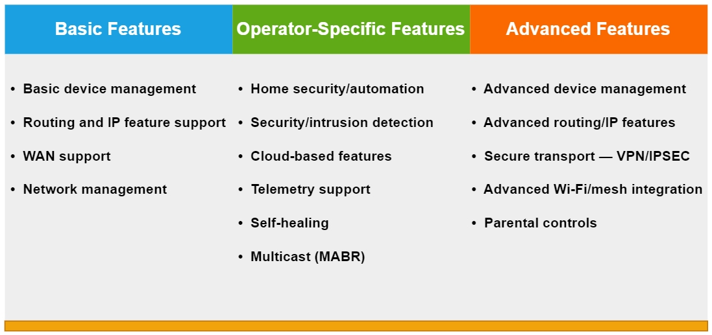
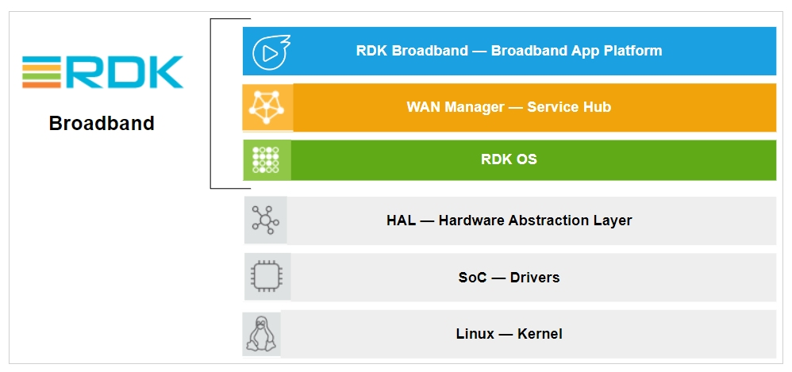
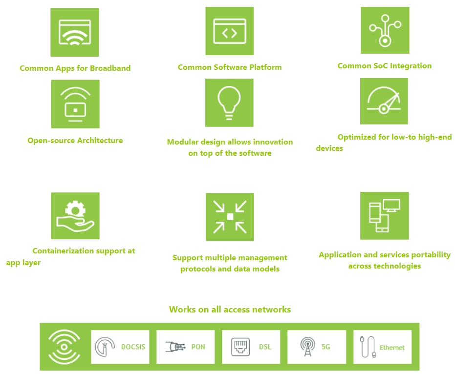

# **RDK-Broadband**

## **RDK Broadband (RDK-B)** **software is capable of powering next-gen gateways across DOCSIS, PON, DSL, 5G, and ethernet, enabling OEMs to standardize elements of their modems, gateways, and converged devices. It allows easy customization of applications and common functionalities such as routing, Wi-Fi, DNS, diagnostics, remote management, and IoT interfaces, such as Bluetooth, Thread, and Zigbee.**

------------------------------------------------------------------------

# **RDK Broadband - Architecture**

------------------------------------------------------------------------

  

# **Benefits of RDK-B**

------------------------------------------------------------------------
