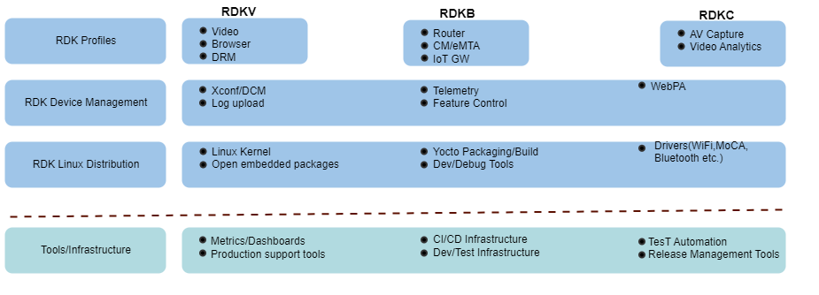
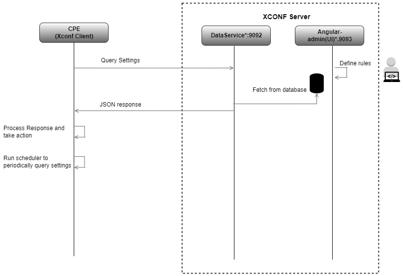

# **Device Management**

## Overview

Device Management is an indispensable requirement to support large scale
deployment. This helps in:

-   Controlled bulk operations/data retrievals
-   Firmware(code) download
-   Dynamically enable/disable features
-   Retrieving field matrices

XCONF/DCM is a management service
that delivers certain configuration details to set-top-boxes
(STB). Remote devices like set top boxes have settings to control
certain activities. For instance, STBs need to know when to upload log
files, or when to check for a new firmware update. In order to remotely
manage a large population of devices, we need a solution that lets
support staff define instructions and get the instructions to the
devices. These are Device Configuration Manager (DCM) and Xconf (X1
Configuration Manager). DCM and Xconf are management services that
delivers certain configuration details to set-top-boxes (STB). 

Xconf (X1 Configuration Manager) and Device Configuration Manager (DCM)
began as separate solutions. Both the server and STB implementations
evolved separately, yet both had overlapping functionality.
Now, engineers have consolidated the server modules.
The single name of the device
configuration management service is XCONF. In the client side, the
scripts and components are still named as DCM.

Device Management feature is horizontally scaled between different RDK
profiles (like RDK-V, RDK-B and RDK-C) as shown in the below diagram.
This means that the same code can be shared between different RDK
profiles.

  

XCONF has client component ie CPE device component and server side
component. XCONF's primary purpose is to tell STBs where to send their
log files and what telemetry metrics they should be sending. XCONF does
not receive logs or telemetry from the boxes. It simply tells the STB
where to send log files or telemetry and what specific metrics it should
be sending. XCONF also tells STBs when, where (host), and how (protocol)
to send this data.

XCONF server consists of two web applications: the Data Service part and
Angular-admin (UI). STBs query the XCONF Data Service to get their
configuration details. Angular-admin (UI) allows administrators to
create targeting rules and enter all the necessary configuration details
for a rule.

The Xconf-Angular-Admin(UI) provides the web interface for the user. It
lets the user define different types of Model, Environment, MAC Address,
firmware configuration, Device setting configuration and telemetry
rules. The rest controllers handle the request from UI and modify the
data in Cassandra through dataservice. Xconf-dataservice is the main
component of Xconf-OSS which communicates with the STB. The Firmware
Configurations, Common data sets (MAC list, Model and Environment),
telemetry profile, Download location, RFC and feature that are created,
updated or deleted in Admin-UI is stored in cassandra. Dataservice is
responsible to fetch the data from the Cassandra database and send it as
a Response when a STB makes a request to Xconf-dataservice for the
configuration. 

  

Device Management features (using XCONF) include:

1.  **[Code Download (Xconf,
    DCM)](https://wiki.rdkcentral.com/pages/viewpage.action?pageId=211788928)**
2.  **[Log Upload](https://wiki.rdkcentral.com/display/DOC/Log+Upload)**
3.  **[Telemetry](https://wiki.rdkcentral.com/display/DOC/Telemetry)**
4.  **[RDK Feature Control  (RFC)](https://wiki.rdkcentral.com/display/DOC/RDK+Feature+Control+-+RFC)**  
      

Device Management using WebPA is covered
here:  **[WebPA](https://wiki.rdkcentral.com/display/DOC/WebPA)**
