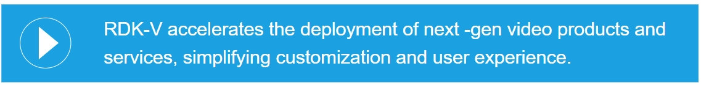

# **RDK-Video Overview**

------------------------------------------------------------------------

------------------------------------------------------------------------
 

------------------------------------------------------------------------

  

# **RDK4**

#### **RDK4** is the latest version of the RDK-V software stack, designed to simplify app development and integration on any set-top device while allowing companies to maintain complete control of their apps, device data, and customer experience.

#### RDK4 is designed for use with Lightning™, a JavaScript-based app development language, but also supports HTML5 web apps and native streaming video apps integrated through Firebolt®.

  

### **RDK4 Includes**

------------------------------------------------------------------------

