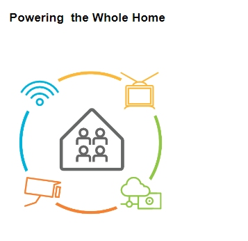
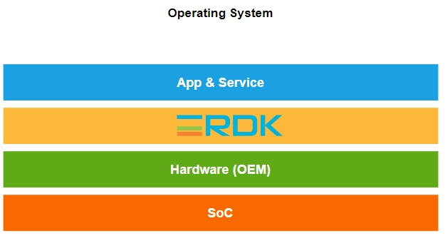
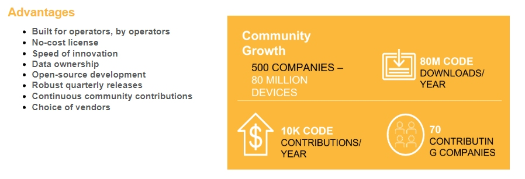
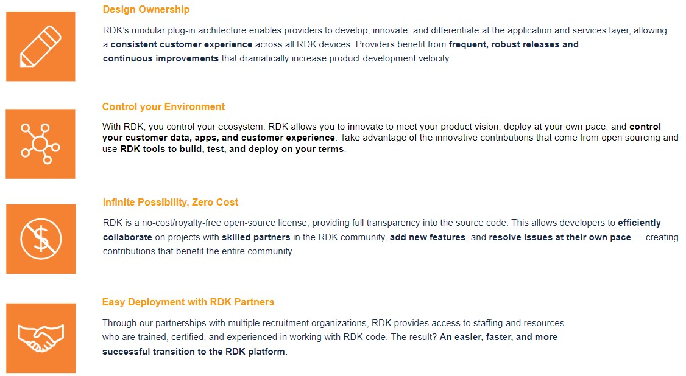
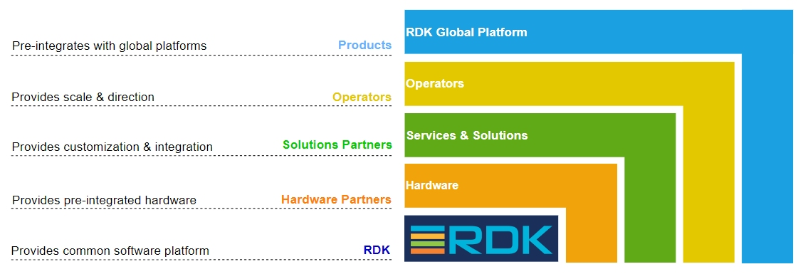

# **What is RDK?**

## RDK is the software that helps run video, broadband, and IoT devices more efficiently by standardizing the software stacks that run on most TV set-top boxes, internet gateways, and IoT devices in the home.

## **Collaborate.**

## **Differentiate.**

## **Innovate.**

  

------------------------------------------------------------------------

**Why
to
u****se**
**RDK?**

##### **By utilizing** **open**-**source** **components,** **RDK** **drastically** **reduces** **development** **cycles,** **encourages** **collaboration,** **and** **enhances** **innovation.** Millions of devices around the globe rely on free RDK software to power their next-generation video and broadband services. RDK community members continually enhance the RDK stack through collaboration and contributions; that means limitless innovation and unrivaled speed to market for global service providers of all types. While customers enjoy a wider range of innovative products faster, operators maintain complete control over design, development, deployment, and data.

# **Business Benefits of RDK**

------------------------------------------------------------------------

------------------------------------------------------------------------

# **The RDK Ecosystem**

The
leading operators,
solution
partners,
hardware
providers,
and
product
developers
from
around
the
world
contribute to the expanding
RDK community. We connect
our members to facilitate
the best solutions for
service
providers,
their
customers,
and
the
entire
industry.

  

------------------------------------------------------------------------

## RDK Broadband

RDK Broadband (RDK-B) software is capable of powering next-gen gateways
across DOCSIS, PON, DSL, 5G, and ethernet, enabling OEMs to standardize
elements of their modems, gateways, and converged devices.

[Click here to know more](RDK_BB_Overview.md)

  
## RDK Video

RDK accelerates the deployment of next-gen video products and services,
simplifying customization and user experience.

[Click here to know more](RDK_Video_Overview.md)